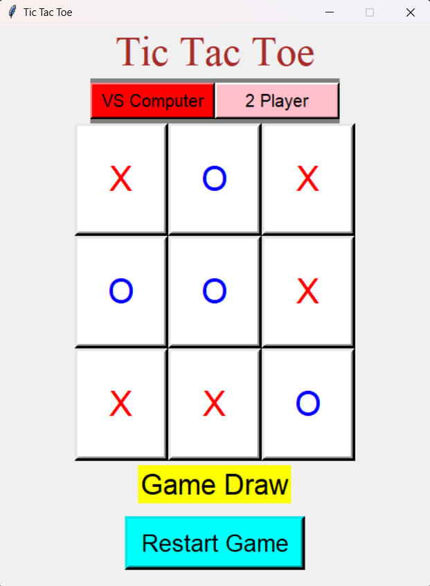
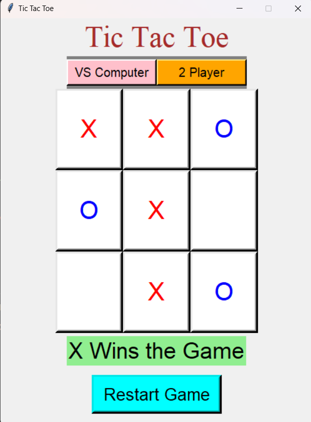

# Tic Tac Toe Game

A simple Tic Tac Toe game implemented in Python using Tkinter, featuring Singleplayer and Multiplayer modes with colored player moves. The game uses the MiniMax algorithm for the computer's moves in Singleplayer mode.

## Features

- Two modes: Singleplayer (vs Computer) and Multiplayer (2 Players).
- Visual indicators for the current player using colors:
  - Singleplayer
    - Player X: Red
    - Computer O: Blue
  - Multiplayer
    - Player X: Red
    - Player O: Blue
- Restart game functionality to play multiple rounds without restarting the application.
- User-friendly graphical interface with a 3x3 grid for game play.

## Installation

1. Clone the repository:
    ```bash
    git clone https://github.com/HarisrujanYakkaluru/Tic-Tac-Toe-Ai.git
    ```
2. Navigate to the project directory:
    ```bash
    cd Tic-Tac-Toe-Ai
    ```
3. Ensure you have Python installed. This program requires Python 3.x.
4. Install Tkinter if it's not already installed:
    ```bash
    pip install tk
    ```

## Usage

1. Run the `Tic_Tac_Toe_Ai.py` script:
    ```bash
    python Tic_Tac_Toe_Ai.py
    ```
2. The game window will open with options to select Singleplayer or Multiplayer mode.
3. Click on the grid to make your move. In Singleplayer mode, the computer will automatically make its move.
4. The game will display a message indicating the winner or if the game is a draw.
5. Use the "Restart Game" button to reset the board and play again.

## Screenshots

### Main Screen
.png)

### Singleplayer


### Multiplayer


## Contributing

Contributions are welcome! Please fork the repository and submit a pull request with your changes.

## License

This project is licensed under the MIT License. See the [LICENSE](LICENSE) file for details.

## Acknowledgments

- This project was inspired by classic Tic Tac Toe games.
- The Tkinter library documentation and community provided valuable resources for building this application.
